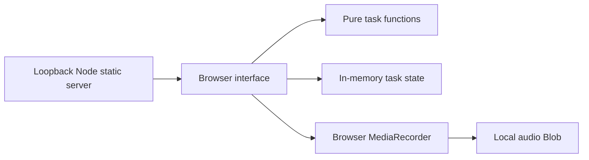

# Focus Flow Demo

A small, local productivity demonstration: capture a task quickly, give it a priority, complete it, and explore an escalating reminder sequence. Optional voice memos demonstrate capture without typing.

> Portfolio demonstration based on a real-world use case; client identity and operational data removed/replaced.

## Run

Node.js 22 or later. No install, API key or account is required.

```sh
npm start
```

Open `http://127.0.0.1:4319`.

```sh
npm test
npm run check
```

## Demonstrated behavior

- Three fictional starting tasks; create, sort, filter, complete and remove tasks.
- Importance levels and optional due times.
- Daily/weekly recurrence for scheduled tasks, with duplicate completion prevented.
- Four increasingly direct reminder messages, triggered manually and labeled simulated.
- Browser microphone recording, maximum 60 seconds and three memos per session.
- Accessible labels, responsive layout and text-safe rendering.
- Reset restores the fictional starting scenario and clears recorded memos.

## Architecture and stack



**Stack:** Node.js standard library, browser ES modules, HTML/CSS, MediaRecorder and Node test runner. The server serves only approved asset types from the public directory and accepts no writes. There are no runtime package dependencies.

This focused edition reconstructs the audited task, priority, recurrence and voice-capture use case with fresh interface code and synthetic fixtures. It intentionally excludes the original backend, user PINs, signed user tokens, private local environment, cloud database, push subscriptions, clinical/profile data and artwork. It is not a feature-complete copy of the original application.

## Privacy and limits

State and audio stay in this browser tab's memory and disappear on reload. There is no storage API, user login, cloud sync, service worker or network push. Microphone capture occurs only after a user click and browser permission. Audio is not uploaded, transcribed or sent to an AI service. Closing the page stops microphone tracks.

Reminders are manually simulated; they do not run in the background. Recurrence adds fixed 24-hour or seven-day intervals rather than a timezone-aware calendar schedule. This is a productivity prototype with no claim of medical benefit. It should only be used with demonstration content.

For a future voice-agent portfolio extension, transcription, reviewed task extraction and optional spoken feedback could be evaluated with synthetic audio and explicit consent. Those features are **not implemented** here.

## Release

The repository has a new history and no intended secret material. `.env.example` is deliberately empty: no environment configuration is needed. The application remains local even if source code is made public; a hosted demo would be a separate deployment. Keep the repository private until the owner approves public visibility.
